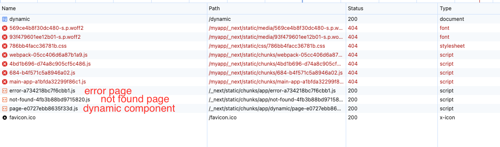

## to start
1. `npm ci`
2. `npm run build`
3. `npm start`
4. visit http://localhost:3000/dynamic
5. inspect network tab 
6. see a couple resources not having `assetPrefix` 

### all other routes
app router
- http://localhost:3000/dynamic
- http://localhost:3000/static

page router
- http://localhost:3000/page-static
- http://localhost:3000/page-dynamic

